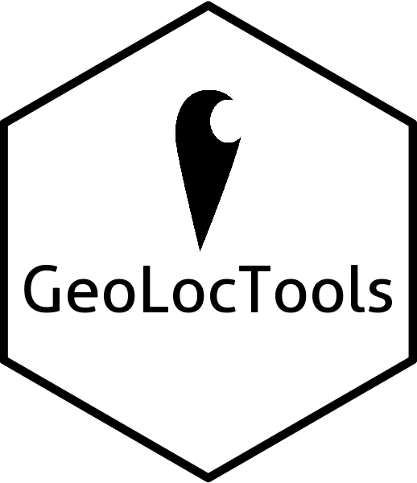

# GeoLocTools 

A set of functions to pre-process geolocation tracking data. This includes 
both light loggers, GPS loggers of all kinds, and tries to ensure 
interchangeability between various devices and formats
for synthesis and analysis. Currently the set of functions is limited but we
are sure this set will grow over time, due to personal use or user
contributions.

Due to the inclusion of a high resolution geoid map the package is fairly large
(97 MB). This is less than ideal, yet functional. A solution will be sought for
this situation to be more CRAN compliant.

Warning: this package is made on personal request and therefore is a temporary
convenience tool. Although the intention is to solidify some of this more
permanently, when and how is to be seen. The package might therefore change
name and function at any time. Do not rely on this code operationally in
an online workflow.

## Installation

### development release

To install the development releases of the package run the following
commands:

``` r
if(!require(devtools)){install.packages("devtools")}
devtools::install_github("bluegreen-labs/geoloctools")
library("geoloctools")
```

## Use

### Reading PathTrack position (.pos) files

The `glt_read_pos()` function reads in PathTrack position files into a
data frame. By default the altitudes are reported as values above mean sea
level (corrected from ellipsoide heights to topographic heights by
compensating for [egm2008 one degree geoid model](https://geographiclib.sourceforge.io/1.18/geoid.html)). We do note that due to
the bilinear interpolation instead of cubic interpolation a slight loss in
accuracy is noted. However, with an error of 0.025m this value is well below
the error on commercial animal loggers.

```r
library(geoloctools)
df <- glt_read_pos("your_position_file.pos")
```

### Converting Migrate Technology data to PAMLr formatting

If you've installed the package you can also generate activity and light logging
plot (based upon the code in the `PAMLr` documentation) by converting Migrate
Technology light logger files to the `PAMLr` R package format for further
processing.

```r
library(geoloctools)
library(pamlr)
library(tidyverse)

# load demo data from Migrate Technologies files
PAM_data <- glt_migtech_pamlr(
  system.file(
        "extdata",
        package = "geoloctools",
        mustWork = TRUE)
  )

# grab one particular logger (subset main list)
PAM_data <- PAM_data$CC893

# plot activity and light levels as shown in the
# PAMLr documentation
par( mfrow= c(1,2), oma=c(0,2,0,6))
par(mar =  c(4,2,4,2))

plot_sensorimage(PAM_data$acceleration$date, ploty=FALSE,
                 log(PAM_data$acceleration$act+0.001), main = "Activity",
                 col=c("black",viridis::cividis(90)), cex=1.2, cex.main = 2)

plot_sensorimage(PAM_data$light$date, labely=FALSE,
                 PAM_data$light$obs,  main="Light",
                 col=c("black",viridis::cividis(90)), cex=1.2, cex.main = 2)
```


